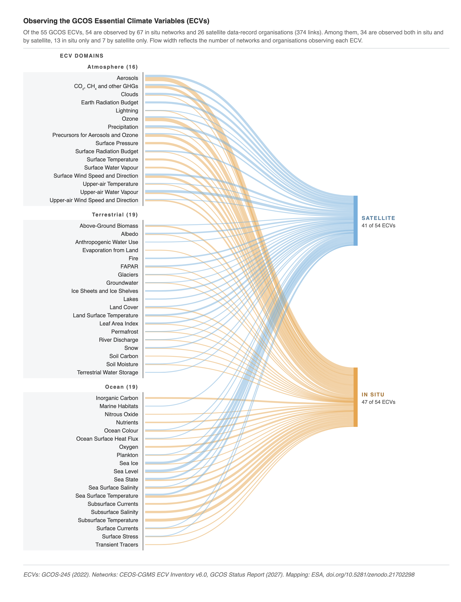

# Sankeys linking GCOS Essential Climate Variables to the networks that observe them

*Companion code for the workbook "Observing the GCOS Essential Climate Variables (ECVs)" ([10.5281/zenodo.21702298](https://doi.org/10.5281/zenodo.21702298)).*

This workbook maps the 55 GCOS Essential Climate Variables (ECVs) to the in situ observing networks and satellite data-record organisations that monitor them, drawing on the GCOS ECV list (2022), the WGClimate CEOS-CGMS ECV Inventory v6.0 and in situ network records from the GCOS Status Report (2027).



Four scripts generate seven sankey figures: 

| Script | Figure | Preview |
|---|---|---|
| `ecv-network-type.py` | Each ECV to its observing types, satellite and in situ; the full mapping below, collapsed | above |
| `ecv-all-networks.py` | The full mapping: each ECV to every named network and organisation | **[here](sankeys/ecv-all-networks.png)** |
| `ecv-insitu-satellite.py insitu` | ECVs to in situ networks only, grouped by the domains each network serves | **[here](sankeys/ecv-insitu-networks.png)** |
| `ecv-insitu-satellite.py satellite` | ECVs to satellite data-record organisations only | **[here](sankeys/ecv-satellite-networks.png)** |
| `ecv-domain-networks.py atmosphere` | Atmosphere ECVs to their networks and organisations | **[here](sankeys/ecv-atmosphere-networks.png)** |
| `ecv-domain-networks.py terrestrial` | Terrestrial ECVs to their networks and organisations | **[here](sankeys/ecv-terrestrial-networks.png)** |
| `ecv-domain-networks.py ocean` | Ocean ECVs to their networks and organisations | **[here](sankeys/ecv-ocean-networks.png)** |


## Setup

Download the workbook from https://doi.org/10.5281/zenodo.21702298 and place it in `./data/`, then run:

```bash
pip install -r requirements.txt
python src/ecv-network-type.py
```

This writes `ecv-network-type.html` to the current directory and opens it in a browser. The two scripts that make more than one figure take the figure name as their first argument, as in the table above, and write it to `ecv-<name>-networks.html`; run them without it to make all of their figures at once. The HTML files are self-contained and work offline. To build all seven without opening a browser:

```bash
for script in src/ecv-*.py; do python "$script" --no-open; done
```

| Argument / Option | Effect |
|---|---|
| `insitu` \| `satellite` \| `both` | Which figure `ecv-insitu-satellite.py` builds (default: both) |
| `atmosphere` \| `terrestrial` \| `ocean` \| `all` | Which figure `ecv-domain-networks.py` builds (default: all) |
| `--workbook PATH` | Path to the mapping workbook |
| `--outdir PATH` | Where to write the HTML (default: current directory) |
| `--no-open` | Write the files without opening a browser |


## Data interpretation

Input data comes from the workbook tab **`5.2 ECV-Network Sankey Links`**.

| Column | Description |
|---|---|
| `ecv_domain` | Earth-system domain the ECV belongs to, written as Atmosphere, Terrestrial or Ocean. |
| `ecv (source)` | The GCOS ECV |
| `network (target)` | Network / Organisation  |
| `type (target)` | In situ / Satellite |
| `value` | 1 for every connection |

Rows whose value is blank, non-numeric or not positive are skipped. Rows whose domain is not one of the three are skipped too, and the script reports how many on the console. The figures encode connections, not magnitudes: a node's width is its number of links.


## Configuration

Colours, row pitch, margins and label sizes sit at the top of the `<script>` block in each script. In the two multi-figure scripts, what differs between their figures lives in the `FIGURES` table. All figures are 794 px wide (A4 portrait at 96 dpi), so widening a label gutter narrows the flows rather than the page. 

Network rows have a fixed pitch and the ECV rows stretch to match, between `ROW_L_MIN` and `ROW_L_MAX`, so the page height follows the number of rows drawn.


## Licence

Code is [MIT](LICENSE). The workbook and the figures it generates are [CC BY 4.0](https://creativecommons.org/licenses/by/4.0/). Bundles `d3-selection` (ISC, © 2010–2021 Mike Bostock), see [`vendor/d3-selection-LICENSE.txt`](vendor/d3-selection-LICENSE.txt).
